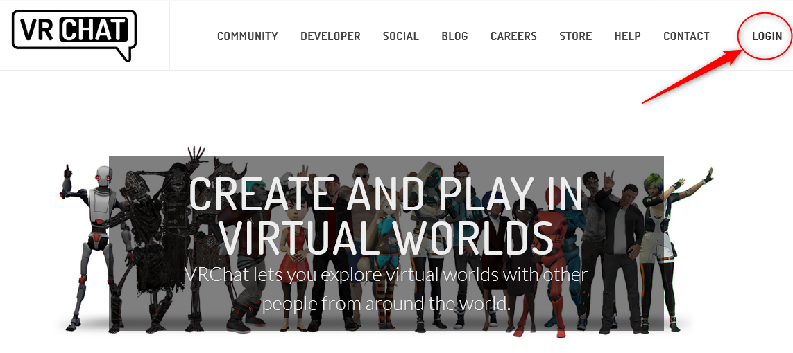
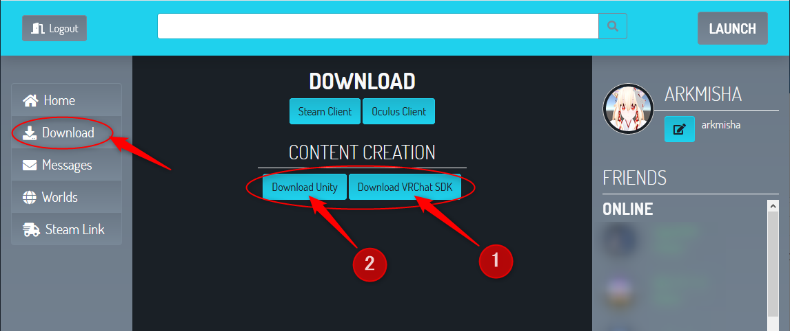
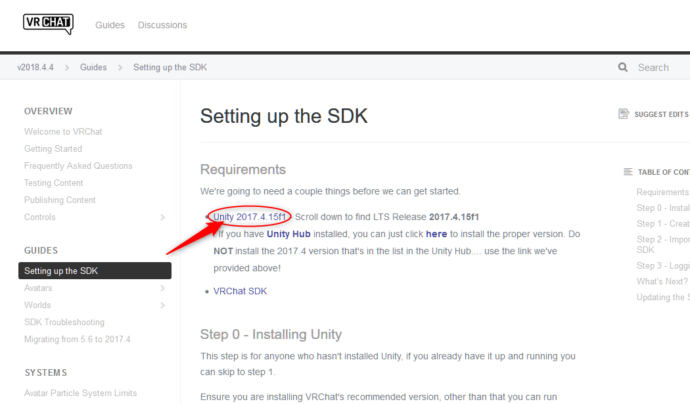
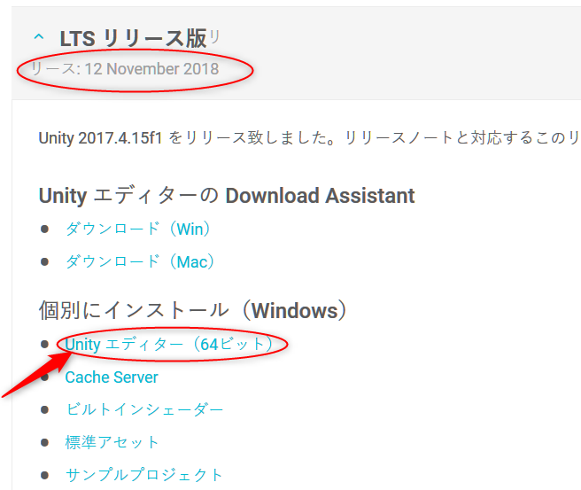

# 1.1. Unity のインストール

VRChat は **Unity** というゲームエンジンで動いており、アバターやワールドの開発も **Unity** を使用して開発します。  
Unity には様々なバージョンがありますが、2019年1月現在、 **Unity 2017.4.15f1** というバージョンを使用します。これ以外のバージョンではうまく動作しないので注意してください。

## 1.1.1 Unity および VRChat SDK のダウンロード

VRChat公式サイト([https://www.vrchat.net](https://www.vrchat.net))へアクセスし、右上の [LOGIN] から自分のアカウントでログインします。

ログイン出来たら、左メニューの [Download] をクリックした後、先に [Download VRChat SDK] をクリックし、VRChat SDK をダウンロードしてください。

[Download Unity] をクリックすると以下の画面に移るので、下記リンクをクリックします。

すると Unity のサイトに飛ぶので、下の方にスクロールしていき **リリース 12 November 2018** を開き、[Unity エディター] をクリックしてダウンロードします。

## 1.1.2 Unity のインストール

Unity のインストール方法については割愛します。
