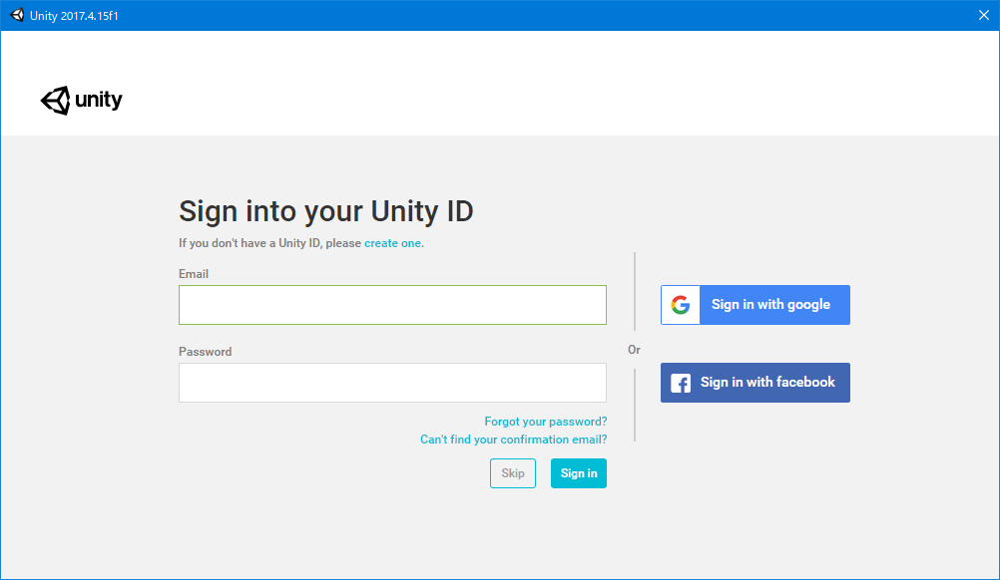
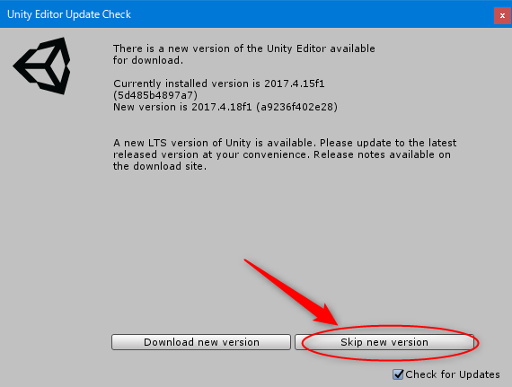

# 2.1. プロジェクトの作成

VRChat アバター開発用のプロジェクトを作成していきます。  
初回起動時に以下の画像のように Unity のアカウントを求められると思います。今後 Asset Store などを利用する際に使用するので、サインインしておきましょう。面倒であれば [Skip] でいいです。

早速プロジェクトを作成していきます。 [New] をクリックし、以下の情報を入力します。

|項目|値|
|:--|:--|
|Project Name|好きなプロジェクト名(ここでは **VRChat Avaters** としました )|
|Template|3D|
|Location|好きなパス(ここにプロジェクトが保存されます)|
|Organization|変更なし|

入力出来たら [Create project] をクリックすることで作成されます。

作成後、Unity の新しいバージョンがあるからアップデートするかどうか聞かれますが、動かなくなるのでアップデートしません。[Skip new version] をクリックしてください。

