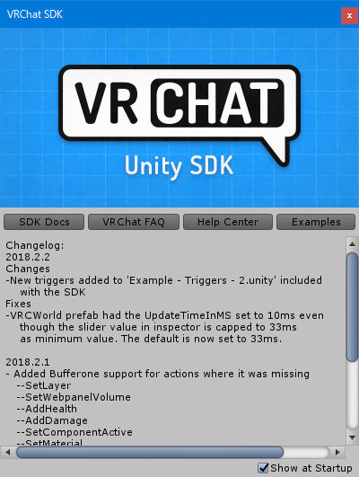

# 2.2. VRChat SDK のインポート

Unity 上で VRChat のコンテンツを開発するのに必要な **VRChat SDK** をインポートします。  
Unity 下方にある **Project** タブの **Assets** を右クリックし、[Import Package] -> [Custom Package...] を選択します。

ダウンロードした VRChat SDK を選択します。「VRCSDK-2018.12.19.17.03_Public.unitypackage」のようなファイル名です(2019年1月現在)。  
下記画像のダイアログが表示されるので [Import] をクリックすることでインポートが開始されます。少し時間がかかりますので気長に待ちます。

うまくインポートできれば下記ウィンドウが出てきます。ことあるごとに出てくるので [×] で閉じましょう。

以上でインポート完了です。