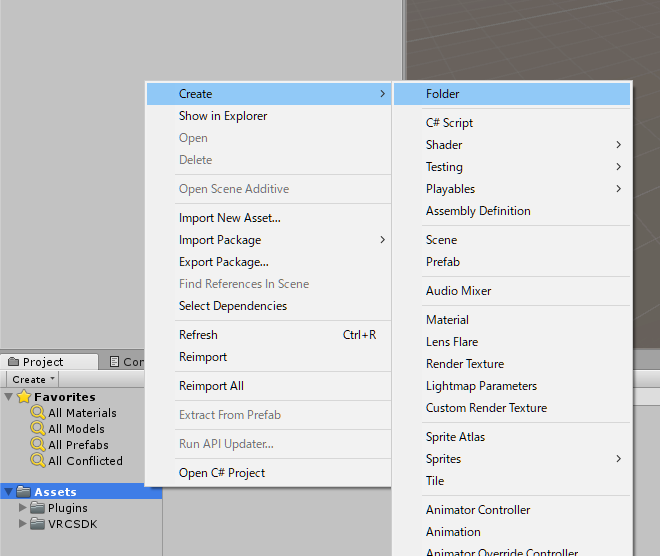
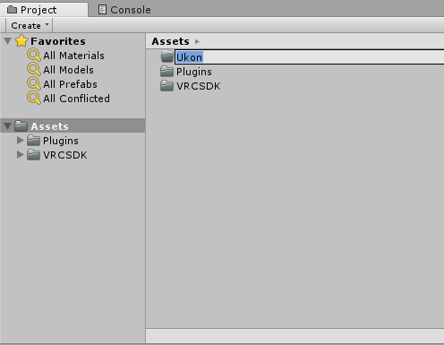
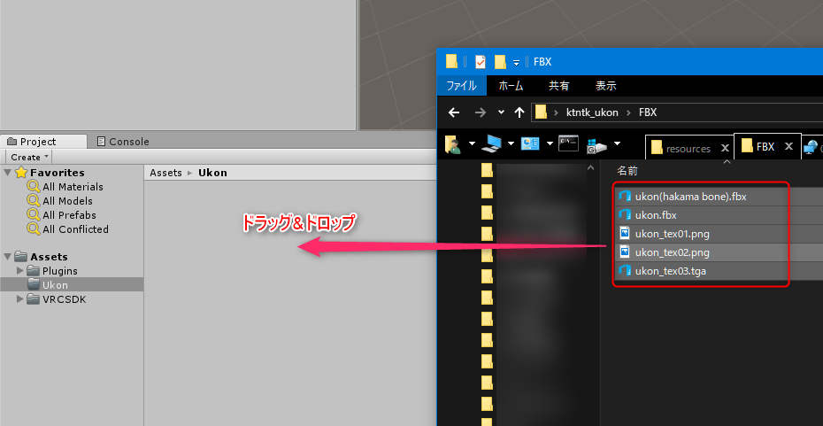

# 2.3. モデルのインポート

いよいよ右近ちゃんをインポートしていきましょう。  
右近ちゃんは **fbx**(UnityやBlenderなどで使われる形式)と **pmx**(MikuMikuDance) の2つの形式がありますが、今回は Unity で使用するので **fbx** を使います。  

## 2.3.1. 右近ちゃんの構成

まずは予めダウンロード・解凍しておいた右近ちゃんのフォルダを開きましょう。  
`(解凍先)\ktntk_ukon\FBX` を開くと、5つのファイルがあります。それぞれのファイルは以下の用途で使います。

|ファイル名|説明|
|:--|:--|
|ukon(hakama bone).fbx|右近の3Dモデル(袴にボーンが入っている)|
|ukon.fbx|右近の3Dモデル|
|ukon_tex01.png|顔やアクセサリのテクスチャ|
|ukon_tex02.png|服や下駄のテクスチャ|
|ukon_tex03.tga|瞳や表情のテクスチャ|

右近ちゃんには袴にボーンが入っているものと入っていないものの2つがあります。後々袴を揺らしたりしたければ、ボーン入りを使いましょう。

## 2.3.2. インポート

それでは Unity へインポートしていきます。右近ちゃんの場合基本的には Asset の中へドラッグ&ドロップでインポートしますが、そのまま入れていくと Asset の中身がぐちゃぐちゃになるので予めフォルダ分けしましょう。  
Unity 下方の Project タブ、Assets 上で右クリックし、Create -> Folder を選択します。

名前を付けて確定します(ここでは **Ukon** とします)。

作成したフォルダをダブルクリックして開きます。

解凍した右近ちゃんのフォルダに戻り、5つのファイル全部選択して先ほど作成したフォルダに **ドラッグ&ドロップ** します

以上でインポート完了です。

## 2.3.3. VRChat で使用するための設定

